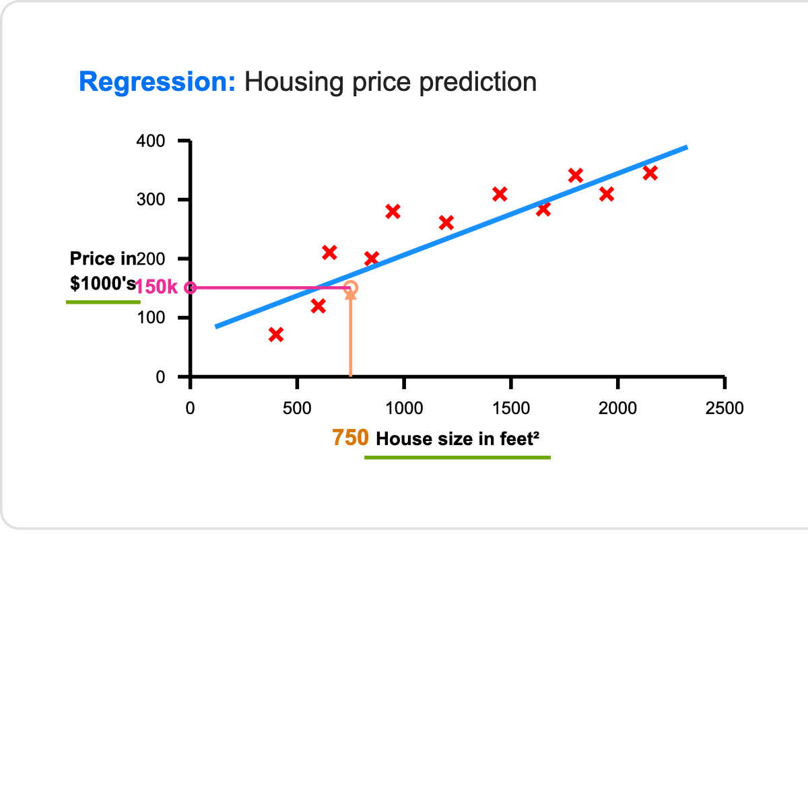
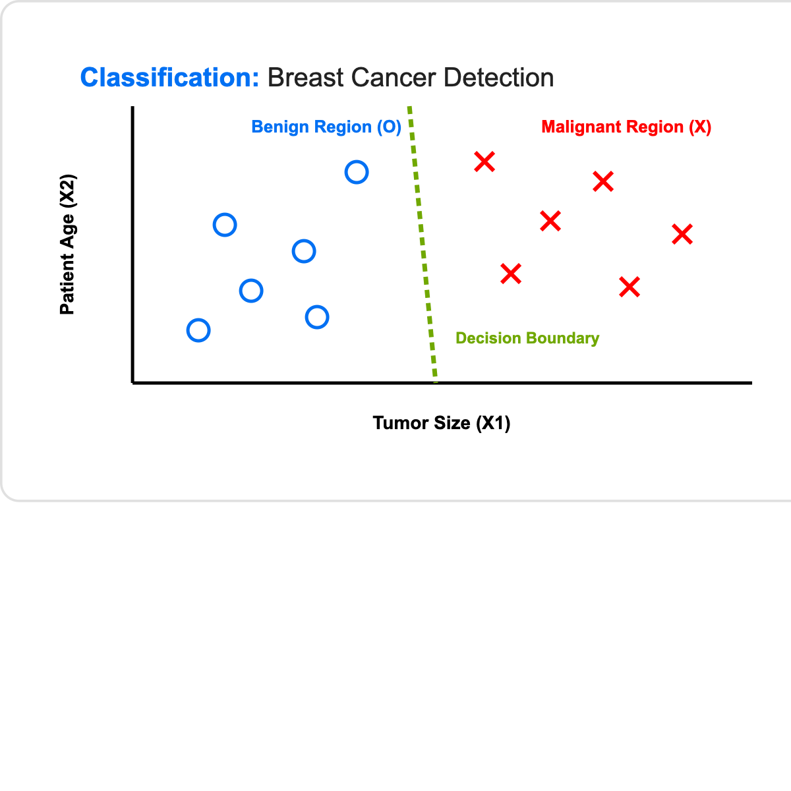

# 02. Supervised Learning

> **Core Concept**: Supervised Learning algorithms learn input-to-output ($X \longrightarrow Y$) mappings. The algorithm is provided with training data containing both the input $X$ and the correct target label $Y$ ("the right answer"). Once trained, it predicts output $Y$ for new, unseen input $X$.

---

## 📌 1. Fundamentals of Supervised Learning

* **Economic Value**: ~99% of the economic value created by AI/ML today is driven by Supervised Learning.
* **Mechanism**:

$$\text{Training: } \text{Input } X + \text{Label } Y \longrightarrow \text{Model } f(X)$$

$$\text{Inference: } \text{New Input } X_{\text{new}} \xrightarrow{\quad f(X_{\text{new}}) \quad} \text{Predicted Label } \hat{Y}$$

---

## 🌐 2. Industry Input-to-Output ($X \to Y$) Applications

| Input ($X$) | Output Label ($Y$) | Application Domain | Economic/Business Impact |
| :--- | :--- | :--- | :--- |
| Email content & metadata | Spam (1) / Inbox (0) | Email Spam Filter | Security & user productivity |
| Audio clip | Text transcript | Speech Recognition | Voice assistants, captioning |
| Source language text (e.g. English) | Target language text (e.g. Spanish) | Machine Translation | Cross-border communication |
| User profile & Ad features | Click (1) / No Click (0) | Online Advertising | Ad platform revenue engine |
| Camera feeds + Radar data | Surrounding vehicle coordinates | Self-Driving Cars | Autonomous navigation |
| Manufactured product photo | Scratch/Defect (1) or Clean (0) | Visual Inspection (Manufacturing) | Quality assurance & defect prevention |
| House size (sq ft) | Price ($) | Housing Price Prediction | Real estate valuation |

---

## 📈 3. Sub-type 1: Regression (Continuous Prediction)

**Regression** algorithms predict a continuous numerical value from **infinitely many possible numbers**.

$$\text{Output Space } Y \in \mathbb{R} \quad (\text{e.g., } 150,000, 183,420, 200,000)$$

### 🏠 Case Study: Housing Price Prediction (Mental Model)

* **Input ($X$)**: House size in feet²
* **Target ($Y$)**: House price in $1000's



#### How to Read This Mental Model:
1. **Training Data ($X, Y$)**: Each red cross ($\mathbf{X}$) represents a historical house sale (Size on X-axis, Price on Y-axis).
2. **Model Training**: The regression algorithm fits a blue straight line ($y = wx + b$) through the data points.
3. **Inference**: For a new house of size $750\text{ feet}^2$:
   * Follow the orange arrow up from $750$ to the regression line.
   * Trace the pink line horizontally left to the Y-axis to read the predicted price: **$150,000**.

---

## 🏷️ 4. Sub-type 2: Classification (Discrete Prediction)

**Classification** algorithms predict a discrete category or class label from a small, finite set of possibilities.

$$\text{Output Space } Y \in \{0, 1, \dots, K-1\} \quad (\text{Discrete Classes / Categories})$$

> 💡 *Note*: The terms **Output Classes** and **Output Categories** are used interchangeably.

### Classification Types

1. **Binary Classification**: Only 2 possible classes.
   * Example: $0 = \text{Benign (Non-cancerous)}$, $1 = \text{Malignant (Cancerous)}$.
   * Example: $0 = \text{Not Spam}$, $1 = \text{Spam}$.
2. **Multi-class Classification**: 3 or more possible classes.
   * Example: $0 = \text{Benign}$, $1 = \text{Type 1 Cancer}$, $2 = \text{Type 2 Cancer}$.
   * Example: Predict image labels $\in \{\text{Cat}, \text{Dog}, \text{Bird}\}$.

---

### 🩺 Case Study: Breast Cancer Diagnosis

#### A) Single Input Feature ($X = \text{Tumor Size}$)

Data points plotted along a 1D line using symbols: **O** for Benign ($0$) and **X** for Malignant ($1$).

```
Diagnosis (Y)
    1 (Malignant) |                  X   X   X   X
                  |
    0 (Benign)    |    O   O   O
                  +-----------------------------------> Tumor Size (X)
```

#### B) Multiple Input Features ($X_1 = \text{Tumor Size}, X_2 = \text{Age}$)

When multiple features are provided, the classification algorithm fits a **Decision Boundary** line to separate the categories in multi-dimensional feature space.



> 🧬 **Multi-Feature Vectors**: Industrial medical AI systems use high-dimensional feature vectors: 
> $$X = [\text{Tumor Size}, \text{Patient Age}, \text{Clump Thickness}, \text{Cell Size Uniformity}, \text{Cell Shape Uniformity}]$$

---

## 📊 5. Summary Matrix: Regression vs. Classification

| Feature | Regression | Classification |
| :--- | :--- | :--- |
| **Output Type** | Continuous numerical values ($\mathbb{R}$) | Discrete classes / categories |
| **Output Space** | Infinitely many possible numbers | Small, finite set ($\{0,1\}$ or $\{0,1,2\}$) |
| **Target Examples** | House price, temperature, stock price | Spam/Not Spam, Benign/Malignant, Cat/Dog |
| **Model Goal** | Fit a trend line or curve to data | Fit a decision boundary separating classes |
