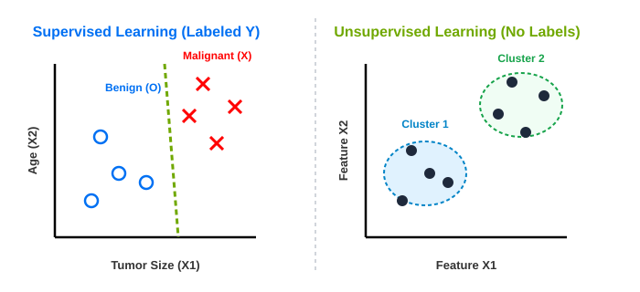

# 03. Unsupervised Learning: Clustering, Anomaly Detection & Dimensionality Reduction

> **Core Concept**: Unsupervised Learning algorithms process data containing **inputs $X$ only (no target output labels $y$)**. The algorithm's objective is to autonomously discover hidden structures, patterns, anomalies, or compressed representations in the data without human supervision.

---

## 📌 1. Formal Definition: Supervised vs. Unsupervised

$$\text{Supervised Learning: } \{(X_1, y_1), (X_2, y_2), \dots, (X_m, y_m)\} \implies \text{Learns } f(X) \approx y$$

$$\text{Unsupervised Learning: } \{X_1, X_2, \dots, X_m\} \implies \text{Discovers Structure / Patterns in } X$$



---

## 🎯 2. Three Major Types of Unsupervised Learning

```
                           ┌───────────────────────────┐
                           │   Unsupervised Learning   │
                           └─────────────┬─────────────┘
                                         │
     ┌───────────────────────────────────┼───────────────────────────────────┐
     ▼                                   ▼                                   ▼
┌──────────────────────────┐   ┌──────────────────────────┐   ┌──────────────────────────┐
│        Clustering        │   │    Anomaly Detection     │   │ Dimensionality Reduction │
│  Group similar data      │   │  Detect unusual events   │   │  Compress data features  │
│  points together         │   │  (e.g., Financial Fraud) │   │  without losing info     │
└──────────────────────────┘   └──────────────────────────┘   └──────────────────────────┘
```

### 1️⃣ Clustering
* **Goal**: Partition unlabeled data into groups based on feature similarity.
* **Real-World Applications**:
  1. **Google News Aggregation**: Crawls hundreds of thousands of daily articles and automatically clusters stories sharing words like `"panda"`, `"twin"`, `"zoo"`.
  2. **Genetic Microarray Analysis**: Groups DNA profiles across thousands of genes into genetic subtypes ($\text{Type 1}$, $\text{Type 2}$, $\text{Type 3}$).
  3. **Customer Market Segmentation**: Clusters customer databases by underlying motivations (e.g. Skill Seekers, Career Advancers, AI Enthusiasts).

---

### 2️⃣ Anomaly Detection
* **Goal**: Detect rare, unusual events or data points that deviate significantly from standard behavior.
* **Real-World Applications**:
  * **Financial Fraud Detection**: Flagging unusual credit card transactions or banking activity.
  * **System Health & Monitoring**: Detecting unexpected cloud server memory/CPU spikes before a system outage occurs.

---

### 3️⃣ Dimensionality Reduction
* **Goal**: Compress a high-dimensional dataset (e.g., 100+ features) into a smaller feature space (e.g., 2 or 3 features) while retaining maximum information.
* **Real-World Applications**:
  * Data compression & fast model processing.
  * 2D/3D visualization of complex high-dimensional datasets.

---

## 🧩 3. Self-Assessment: Supervised vs. Unsupervised Problem Identification

| Problem Scenario | Paradigm | Reasoning |
| :--- | :--- | :--- |
| **Spam Filtering** (Emails labeled Spam / Not Spam) | **Supervised** (Classification) | Uses labeled $y$ outputs (Spam=1, Inbox=0). |
| **Google News Aggregation** | **Unsupervised** (Clustering) | Groups articles automatically with no human topic labels. |
| **Customer Market Segmentation** | **Unsupervised** (Clustering) | Discovers customer persona groups from raw behavior data $X$. |
| **Diagnosing Diabetes** (Patient records labeled Diabetes / No Diabetes) | **Supervised** (Classification) | Uses labeled medical diagnosis $y$ (Diabetes=1, Healthy=0), identical to breast cancer classification. |

---

## 🎯 Summary Checklist

- [x] **Unsupervised Learning**: Inputs $X$ only (no target output labels $y$).
- [x] **Three Core Types**:
  1. **Clustering**: Grouping similar data points.
  2. **Anomaly Detection**: Spotting unusual events (Fraud detection).
  3. **Dimensionality Reduction**: Data compression & feature reduction.
