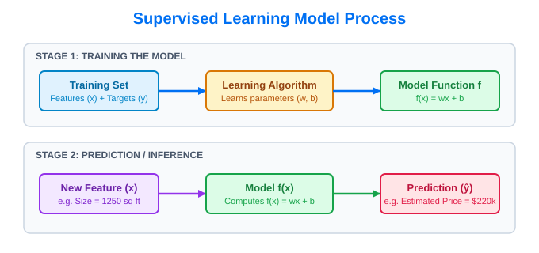
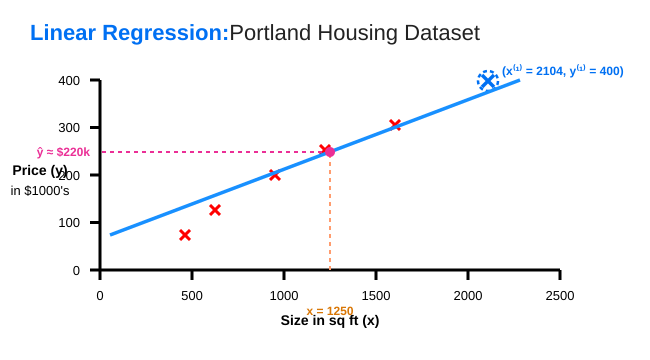

# 04. Linear Regression Model & Standard Notation

> **Core Concept**: **Linear Regression** is a Supervised Learning algorithm that fits a straight line to historical data to predict continuous numerical outputs ($y$). It is the foundational model for predictive analytics in Machine Learning.

---

## 📌 1. Supervised Learning Model Pipeline

Supervised learning operates in two distinct stages: **Training** and **Inference**.



1. **Stage 1 (Training)**: The training dataset containing features ($x$) and target labels ($y$) is fed to the **Learning Algorithm**. The algorithm outputs a **Model Function $f$**.
2. **Stage 2 (Inference)**: When a new feature $x$ (e.g. house size = $1250\text{ sq ft}$) is passed into the model function $f(x)$, it outputs an estimated prediction **$\hat{y}$** ("y-hat").

---

## 📐 2. Model Representation & Formulas

To compute predictions, we mathematically represent the function $f$ as a linear equation:

$$f_{w,b}(x) = w \cdot x + b \quad \text{or simply} \quad f(x) = wx + b$$

* **$x$**: Input feature (e.g., house size in sq ft).
* **$w, b$**: Model parameters (Weights & Bias) that determine the slope and intercept of the line.
* **$f(x)$**: The trained model function (historically referred to as a *hypothesis*).
* **$\hat{y}$ ("y-hat")**: Model prediction ($\hat{y} = f(x)$).

```
+-----------------------------------------------------------------------------------+
| TARGET (y) vs. PREDICTION (ŷ):                                                    |
|                                                                                   |
|   y    <-- The TRUE actual target value from historical training data.           |
|   ŷ    <-- The ESTIMATED prediction calculated by the model function f(x).        |
|                                                                                   |
| Example: Actual sale price y = $400,000; Model prediction ŷ = $390,000.           |
+-----------------------------------------------------------------------------------+
```

---

## 🏠 3. Case Study: Univariate Linear Regression

### What is Univariate Linear Regression?
* **Uni**: One (from Latin).
* **Variate**: Variable.
* **Definition**: Linear regression with **a single input variable/feature $x$** (e.g., size of house).



### Inference Example:
For a client's house with size $x = 1250\text{ sq ft}$:

$$f(1250) = w \cdot 1250 + b \implies \hat{y} \approx \$220,000$$

---

## 📖 4. Standard Machine Learning Notation Reference

The dataset used to train a model is called the **Training Set**. Standard mathematical notation used across AI/ML to describe training data includes:

| Symbol / Notation | Term | Definition | Portland Dataset Example |
| :--- | :--- | :--- | :--- |
| **$x$** | Input Feature / Variable | The input attribute provided to the model | House size (e.g., $2104\text{ sq ft}$) |
| **$y$** | Target Variable / True Label | The actual true value in the training set | True house price (e.g., $400,000) |
| **$\hat{y}$** ("y-hat") | Estimated Prediction | The output computed by model $f(x)$ | Predicted price (e.g., $220,000) |
| **$m$** | Total Training Examples | Total number of rows / data points in dataset | $m = 47$ training examples |
| **$(x, y)$** | Single Training Example | A single ordered pair of input and true output | $(2104, 400)$ |
| **$(x^{(i)}, y^{(i)})$** | $i^{\text{th}}$ Training Example | The specific pair at row index $i$ in data table | Row 1: $(x^{(1)}, y^{(1)}) = (2104, 400)$ |
| **$w, b$** | Model Parameters | Weights and Bias dictating line slope & intercept | Numerical parameters of $f_{w,b}(x)$ |

---

### ⚠️ Critical Notation Rule: Index vs. Exponent

```
+-----------------------------------------------------------------------------------+
| NOTATION DISTINCTION:                                                             |
|                                                                                   |
|   x⁽ⁱ⁾  <-- Parentheses in superscript denotes INDEX (the i-th training example)  |
|   xⁱ    <-- NO parentheses in superscript denotes EXPONENT (x to the power of i)  |
|                                                                                   |
| Example: x⁽²⁾ refers to row 2 in the dataset (NOT x squared).                     |
+-----------------------------------------------------------------------------------+
```

---

## ⚡ 5. Introduction to Cost Functions

To make linear regression work effectively, we must determine the optimal values for parameters $w$ and $b$.

* **Cost Function**: A mathematical function that measures how well a model's predictions ($\hat{y}$) match the actual target values ($y$).
* **Universal Concept**: Cost functions are one of the most fundamental concepts in AI, used to train linear regression, logistic regression, neural networks, and modern deep learning models.

---

## 🎯 Summary Checklist

- [x] **Model Flow**: Training Data $\to$ Learning Algo $\to$ Model $f(x) \to$ Prediction $\hat{y}$.
- [x] **Formula**: $f_{w,b}(x) = wx + b$.
- [x] **Difference**: $y$ = Actual True Target, $\hat{y}$ = Estimated Model Prediction.
- [x] **Univariate**: Linear regression with 1 single input feature $x$.
- [x] **Cost Function**: Objective function used to learn optimal parameters $w, b$.
