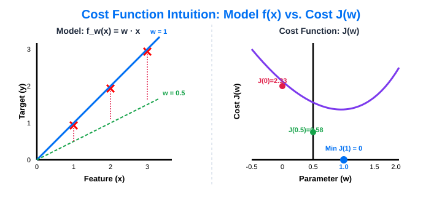
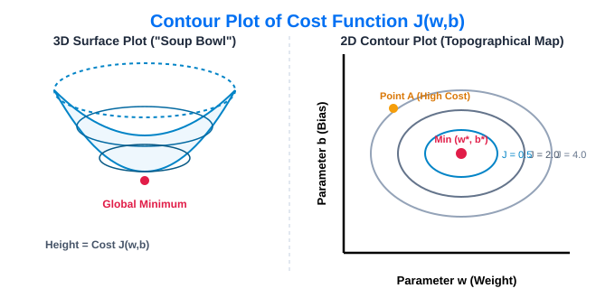

# 05. Cost Function & Intuition

> **Core Concept**: The **Cost Function** measures how well a machine learning model fits the training data by calculating the error between predictions ($\hat{y}$) and true target values ($y$). The primary goal of training is to find model parameters ($w, b$) that **minimize the Cost Function $J(w,b)$**.

---

## 📌 1. Terminology & Parameter Roles

In Linear Regression, the hypothesis model is defined as:

$$f_{w,b}(x) = w \cdot x + b$$

* **Model Parameters ($w, b$)**: Variables that the learning algorithm adjusts during training to improve fit.
  * **$w$ (Weight / Slope)**: Controls the steepness or angle of the line.
  * **$b$ (Bias / Y-Intercept)**: Controls where the line crosses the vertical axis ($f(0) = b$).
  * *Synonyms*: Parameters $w$ and $b$ are also called *weights* or *coefficients*.

---

## 📐 2. Mathematical Definition of Squared Error Cost Function

To quantify model error across $m$ training examples, we compute the **Mean Squared Error (MSE)** cost function $J(w,b)$:

$$J(w,b) = \frac{1}{2m} \sum_{i=1}^{m} \left( f_{w,b}(x^{(i)}) - y^{(i)} \right)^2$$

### Formula Breakdown:

| Term | Mathematical Expression | Purpose |
| :--- | :--- | :--- |
| **Prediction Error** | $f_{w,b}(x^{(i)}) - y^{(i)} = \hat{y}^{(i)} - y^{(i)}$ | Measures how far off the prediction is from true target $y^{(i)}$. |
| **Squared Error** | $\left( f_{w,b}(x^{(i)}) - y^{(i)} \right)^2$ | Ensures all errors are positive and penalizes larger errors more heavily. |
| **Summation ($\sum$)** | $\sum_{i=1}^{m} (\dots)$ | Accumulates total squared error across all $m$ training examples. |
| **Average ($\frac{1}{m}$)** | $\frac{1}{m} \sum (\dots)$ | Computes mean error so cost does not artificially grow with larger datasets. |
| **Division by 2 ($\frac{1}{2m}$)** | $\frac{1}{2}$ multiplier | ML convention to cancel out exponent $2$ during calculus derivative steps later. |

> 💡 **Universality**: The **Squared Error Cost Function** is the most widely used cost function for linear regression and general numeric regression problems.

---

## 🎨 3. Visualizing Cost Function Intuition (Simplified Model $b=0$)

To visualize the relationship between parameters and cost, consider a simplified model where $b = 0$:

$$f_w(x) = w \cdot x \implies J(w) = \frac{1}{2m} \sum_{i=1}^{m} \left( w \cdot x^{(i)} - y^{(i)} \right)^2$$

Because $b=0$, the fitted line always passes through the origin $(0,0)$, and $J(w)$ depends solely on parameter $w$.

---

### 📊 Step-by-Step Walkthrough ($m=3$ Training Points: $(1,1), (2,2), (3,3)$)

Below is how varying $w$ traces out the **U-shaped parabola (bowl shape)** of $J(w)$:

| Weight ($w$) | Line Equation $f(x)$ | Prediction vs. Target ($\hat{y}^{(i)} - y^{(i)}$) | Squared Errors Sum | Cost $J(w)$ | Line Fit Quality |
| :--- | :--- | :--- | :--- | :--- | :--- |
| **$w = 1.0$** | $f(x) = 1.0x$ | $(1-1)=0, (2-2)=0, (3-3)=0$ | $0^2 + 0^2 + 0^2 = 0$ | $J(1.0) = \mathbf{0.0}$ | **Perfect Fit (Global Minimum)** |
| **$w = 0.5$** | $f(x) = 0.5x$ | $(0.5-1)=-0.5, (1-2)=-1, (1.5-3)=-1.5$ | $0.25 + 1.0 + 2.25 = 3.5$ | $J(0.5) = \frac{3.5}{6} \approx \mathbf{0.58}$ | Moderate Error (Underfitting) |
| **$w = 0.0$** | $f(x) = 0$ | $(0-1)=-1, (0-2)=-2, (0-3)=-3$ | $1^2 + 4^2 + 9^2 = 14$ | $J(0.0) = \frac{14}{6} \approx \mathbf{2.33}$ | High Error (Flat Horizontal Line) |
| **$w = -0.5$** | $f(x) = -0.5x$ | $(-0.5-1)=-1.5, (-1-2)=-3, (-1.5-3)=-4.5$ | $2.25 + 9.0 + 20.25 = 31.5$ | $J(-0.5) = \frac{31.5}{6} \approx \mathbf{5.25}$ | Severe Error (Wrong Direction) |

---

## 🍲 4. Full Model Cost Function ($J(w,b)$) in 3D: The "Soup Bowl" Surface

When both parameters $w$ (slope) and $b$ (y-intercept) are active, $J(w,b)$ becomes a **three-dimensional surface**:

* **Horizontal Axes**: Parameters $w$ and $b$.
* **Vertical Axis (Height)**: Cost value $J(w,b)$.
* **Shape**: A 3D paraboloid, shaped like a **soup bowl**, **curved dinner plate**, or **hammock**.
* **Coordinates**: Every point on the 3D surface corresponds to a specific parameter choice $(w,b)$, and its height represents the total error $J(w,b)$ for that choice.

---

## 🗺️ 5. 2D Contour Plots (Level Curves)

To easily inspect 3D cost surfaces on 2D screens, we use **Contour Plots** (identical to topographical elevation maps used in geography, e.g. Mount Fuji).

### Mapping Parameter Choices to Contour Positions:

| Parameter Choice $(w, b)$ | Line Behavior $f(x) = wx + b$ | Contour Location | Cost Value $J(w,b)$ | Fit Quality |
| :--- | :--- | :--- | :--- | :--- |
| **$w = -0.15, b = 800$** | Negative slope, $y$-intercept at 800 | Far outer contour line | Extremely High | Terrible (Severe underestimation) |
| **$w = 0.0, b = 360$** | Flat horizontal line | Outer contour line | High | Poor |
| **Optimal $(w^*, b^*)$** | Line passes directly through data points | **Center of innermost ellipse** | **Lowest Possible ($J_{\min}$)** | **Best Fit** |

---

## ⚡ 6. Transition to Automated Optimization: Gradient Descent

Manually inspecting contour plots or guessing parameter values $(w,b)$ is impractical for complex models.

* **Need for Automation**: Real-world AI models have dozens, thousands, or billions of parameters.
* **The Solution — Gradient Descent**: An algorithm that automatically calculates parameter updates in code to navigate the cost surface step-by-step toward the global minimum $\min_{w,b} J(w,b)$.

---

## 🎯 Summary Checklist

- [x] **Parameters**: $w$ (weight/slope) and $b$ (bias/intercept) define line $f(x) = wx + b$.
- [x] **Cost Function**: $J(w,b) = \frac{1}{2m} \sum_{i=1}^{m} (f(x^{(i)}) - y^{(i)})^2$.
- [x] **3D Surface**: Full model cost function forms a 3D "soup bowl" surface plot.
- [x] **2D Contour Plot**: Horizontal slices of the bowl create concentric ellipses where points on the same ellipse share identical cost $J(w,b)$.
- [x] **Global Minimum**: Located at the center of the innermost ellipse.
- [x] **Gradient Descent**: The automated algorithm used to find parameters $(w,b)$ that minimize $J(w,b)$.
