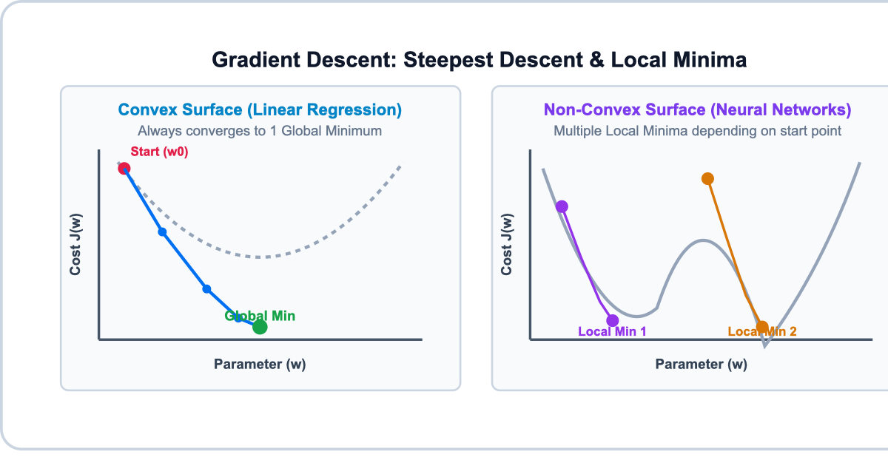
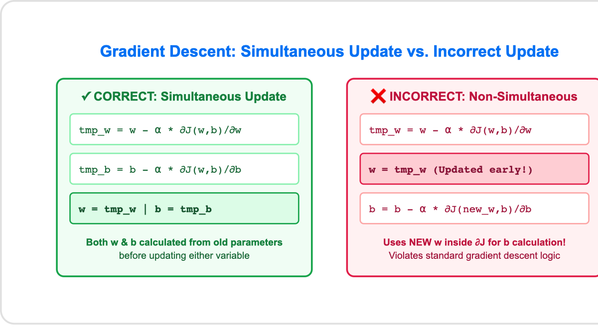
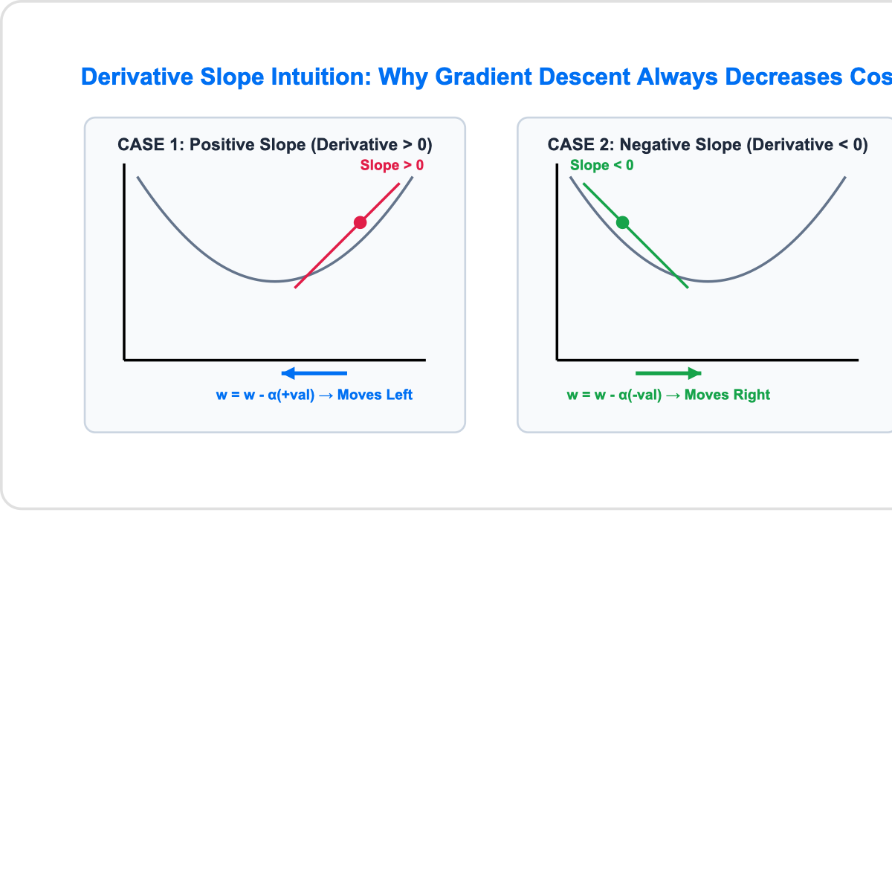
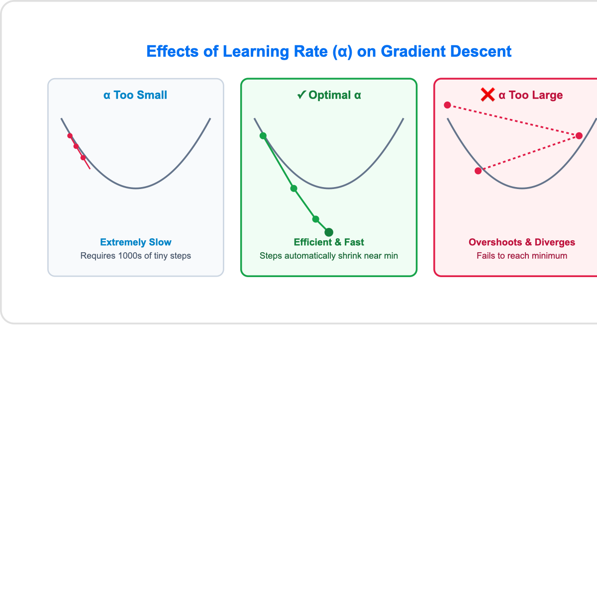

# 06. Gradient Descent Algorithm

> **Core Concept**: **Gradient Descent** is an iterative optimization algorithm used to automatically find parameter values ($w, b$) that minimize a cost function $J(w,b)$. It is the foundational training algorithm for Linear Regression, Neural Networks, and modern Artificial Intelligence.

---

## 📌 1. High-Level Intuition (Steepest Descent)

Imagine standing at a high point on a hilly landscape (the cost surface $J(w,b)$) with the goal of reaching the lowest valley as quickly as possible:

1. **Look 360° around your current position**.
2. **Determine the direction of steepest descent** (the direction that goes downhill fastest).
3. **Take a small step ($\alpha$)** in that direction.
4. **Repeat steps 1–3** until you reach the bottom of the valley (a minimum where slope = 0).



---

## 📐 2. Gradient Descent Update Equations

For Linear Regression with parameters $w$ (weight) and $b$ (bias), **repeat until convergence**:

$$w = w - \alpha \frac{\partial}{\partial w} J(w,b)$$

$$b = b - \alpha \frac{\partial}{\partial b} J(w,b)$$

### Parameter Breakdown:

| Notation                                 | Term                         | Description                                                                            |
| :--------------------------------------- | :--------------------------- | :------------------------------------------------------------------------------------- |
| **$=$**                                  | Assignment Operator          | Assigns the newly calculated value to the parameter variable (in code: `w = w - ...`). |
| **$\alpha$**                             | Learning Rate                | Small positive number (e.g. $0.01$) controlling how large a step is taken downhill.    |
| **$\frac{\partial}{\partial w} J(w,b)$** | Partial Derivative w.r.t $w$ | Measures the slope/steepness of cost function $J$ along the $w$ direction.             |
| **$\frac{\partial}{\partial b} J(w,b)$** | Partial Derivative w.r.t $b$ | Measures the slope/steepness of cost function $J$ along the $b$ direction.             |

---

## ⚠️ 3. Simultaneous Updates (Critical Implementation Rule)

When implementing Gradient Descent in code, **both parameters $w$ and $b$ MUST be updated simultaneously** using their pre-update values.



### Correct vs. Incorrect Python Code:

```python
# ✓ CORRECT: Simultaneous Update
tmp_w = w - alpha * d_dw
tmp_b = b - alpha * d_db
w = tmp_w
b = tmp_b

# ❌ INCORRECT: Non-Simultaneous Update (Modifies w before computing b update!)
w = w - alpha * d_dw  # w is updated early!
b = b - alpha * d_db  # Incorrectly uses NEW w inside derivative for b
```

---

## 🧭 4. Derivative Slope & Movement Direction

​I remember when I first learned about vectorization, ​I spent many hours on my computer ​taking an unvectorized version ​of an algorithm running it, ​see how long it run, and then running ​a vectorized version of the code ​and seeing how much faster that run, ​and I just spent hours playing with that. ​And it frankly blew my mind that ​the same algorithm vectorized would run so much faster. ​It felt almost like a magic trick to me. ​In this video, let's figure ​out how this magic trick really works. ​Let's take a deeper look at how ​a vectorized implementation may ​work on your computer behind the scenes. ​Let's look at this for loop. ​The for loop like this runs without vectorization.
​If j ranges from 0 to say 15, ​this piece of code performs ​operations one after another. ​On the first timestamp which I'm going to write as t0. ​It first operates on the values at index 0. ​At the next time-step, ​it calculates values corresponding to index ​1 and so on until the 15th step, ​where it computes that. ​In other words, it calculates ​these computations one step at a time, ​one step after another. ​In contrast, this function in NumPy is ​implemented in the computer hardware with vectorization. ​The computer can get all values of the vectors w and x, ​and in a single-step, ​it multiplies each pair of w and ​x with each other all at the same time in parallel.
​Then after that, the computer takes these 16 numbers and ​uses specialized hardware to ​add them altogether very efficiently, ​rather than needing to carry out distinct additions ​one after another to add up these 16 numbers. ​This means that codes with vectorization can perform ​calculations in much less time ​than codes without vectorization. ​This matters more when you're running algorithms on ​large data sets or trying to train large models, ​which is often the case with machine learning. ​That's why being able to vectorize implementations ​of learning algorithms, ​has been a key step to getting ​learning algorithms to run efficiently, ​and therefore scale well to large datasets that ​many modern machine learning algorithms ​now have to operate on. ​Now, let's take a look at ​a concrete example of how this helps with ​implementing multiple linear regression ​and this linear regression with multiple input features. ​Say you have a problem with ​16 features and 16 parameters, ​w1 through w16, ​in addition to the parameter b. ​You calculate it 16 derivative terms ​for these 16 weights and codes, ​maybe you store the values of w and d in two np.arrays, ​with d storing the values of the derivatives.
​For this example, I'm ​just going to ignore the parameter b. ​Now, you want to compute an update ​for each of these 16 parameters. ​W_j is updated to w_j minus the learning rate, ​say 0.1, times d_j, ​for j from 1 through 16. ​Encodes without vectorization, ​you would be doing something like this. ​Update w1 to be w1 minus ​the learning rate 0.1 times d1, next, ​update w2 similarly, ​and so on through w16, ​updated as w16 minus 0.1 times d16. ​Encodes without vectorization, you can use a ​for loop like this for j in range 016, ​that again goes from 0-15, ​said w_j equals w_j minus 0.1 times d_j. ​In contrast, with factorization, ​you can imagine the computer's ​parallel processing hardware like this.
​It takes all 16 values in ​the vector w and subtracts in parallel, ​0.1 times all 16 values in the vector d, ​and assign all 16 calculations ​back to w all at the same time and all in one step. ​In code, you can implement this as follows, ​w is assigned to w minus 0.1 times d. Behind the scenes, ​the computer takes these NumPy arrays, w and d, ​and uses parallel processing hardware to ​carry out all 16 computations efficiently. ​Using a vectorized implementation, ​you should get a much more efficient implementation ​of linear regression. ​Maybe the speed difference won't be huge ​if you have 16 features, ​but if you have thousands of ​features and perhaps very large training sets, ​this type of vectorized implementation will make ​a huge difference in ​the running time of your learning algorithm. ​It could be the difference between codes ​finishing in one or two minutes, ​versus taking many hours to do the same thing. ​In the optional lab that follows this video, ​you see an introduction to one of ​the most used Python libraries and Machine Learning, ​which we've already touched on in ​this video called NumPy.
​You see how they create vectors encode and ​these vectors or lists of ​numbers are called NumPy arrays, ​and you also see how to take the dot product of ​two vectors using a NumPy function called dot. ​You also get to see ​how vectorized code such as using the dot function, ​can run much faster than a for-loop. ​In fact, you'd get to time this code yourself, ​and hopefully see it run much faster. ​This optional lab introduces ​a fair amount of new NumPy syntax, ​so when you read through the optional lab, ​please still feel like you have to ​understand all the code right away, ​but you can save this notebook and use it as a reference ​to look at when you're working with ​data stored in NumPy arrays. ​Congrats on finishing this video on vectorization. ​You've learned one of the most ​important and useful techniques ​in implementing machine learning algorithms. ​In the next video, ​we'll put the math of ​multiple linear regression together with vectorization, ​so that you will influence gradient descent for ​multiple linear regression with vectorization.
​Let's go on to the next video. ​I remember when I first learned about vectorization, ​I spent many hours on my computer ​taking an unvectorized version ​of an algorithm running it, ​see how long it run, and then running ​a vectorized version of the code ​and seeing how much faster that run, ​and I just spent hours playing with that. ​And it frankly blew my mind that ​the same algorithm vectorized would run so much faster. ​It felt almost like a magic trick to me. ​In this video, let's figure ​out how this magic trick really works. ​Let's take a deeper look at how ​a vectorized implementation may ​work on your computer behind the scenes. ​Let's look at this for loop. ​The for loop like this runs without vectorization.
​If j ranges from 0 to say 15, ​this piece of code performs ​operations one after another. ​On the first timestamp which I'm going to write as t0. ​It first operates on the values at index 0. ​At the next time-step, ​it calculates values corresponding to index ​1 and so on until the 15th step, ​where it computes that. ​In other words, it calculates ​these computations one step at a time, ​one step after another. ​In contrast, this function in NumPy is ​implemented in the computer hardware with vectorization. ​The computer can get all values of the vectors w and x, ​and in a single-step, ​it multiplies each pair of w and ​x with each other all at the same time in parallel.
​Then after that, the computer takes these 16 numbers and ​uses specialized hardware to ​add them altogether very efficiently, ​rather than needing to carry out distinct additions ​one after another to add up these 16 numbers. ​This means that codes with vectorization can perform ​calculations in much less time ​than codes without vectorization. ​This matters more when you're running algorithms on ​large data sets or trying to train large models, ​which is often the case with machine learning. ​That's why being able to vectorize implementations ​of learning algorithms, ​has been a key step to getting ​learning algorithms to run efficiently, ​and therefore scale well to large datasets that ​many modern machine learning algorithms ​now have to operate on. ​Now, let's take a look at ​a concrete example of how this helps with ​implementing multiple linear regression ​and this linear regression with multiple input features. ​Say you have a problem with ​16 features and 16 parameters, ​w1 through w16, ​in addition to the parameter b. ​You calculate it 16 derivative terms ​for these 16 weights and codes, ​maybe you store the values of w and d in two np.arrays, ​with d storing the values of the derivatives.
​For this example, I'm ​just going to ignore the parameter b. ​Now, you want to compute an update ​for each of these 16 parameters. ​W_j is updated to w_j minus the learning rate, ​say 0.1, times d_j, ​for j from 1 through 16. ​Encodes without vectorization, ​you would be doing something like this. ​Update w1 to be w1 minus ​the learning rate 0.1 times d1, next, ​update w2 similarly, ​and so on through w16, ​updated as w16 minus 0.1 times d16. ​Encodes without vectorization, you can use a ​for loop like this for j in range 016, ​that again goes from 0-15, ​said w_j equals w_j minus 0.1 times d_j. ​In contrast, with factorization, ​you can imagine the computer's ​parallel processing hardware like this.
​It takes all 16 values in ​the vector w and subtracts in parallel, ​0.1 times all 16 values in the vector d, ​and assign all 16 calculations ​back to w all at the same time and all in one step. ​In code, you can implement this as follows, ​w is assigned to w minus 0.1 times d. Behind the scenes, ​the computer takes these NumPy arrays, w and d, ​and uses parallel processing hardware to ​carry out all 16 computations efficiently. ​Using a vectorized implementation, ​you should get a much more efficient implementation ​of linear regression. ​Maybe the speed difference won't be huge ​if you have 16 features, ​but if you have thousands of ​features and perhaps very large training sets, ​this type of vectorized implementation will make ​a huge difference in ​the running time of your learning algorithm. ​It could be the difference between codes ​finishing in one or two minutes, ​versus taking many hours to do the same thing. ​In the optional lab that follows this video, ​you see an introduction to one of ​the most used Python libraries and Machine Learning, ​which we've already touched on in ​this video called NumPy.
​You see how they create vectors encode and ​these vectors or lists of ​numbers are called NumPy arrays, ​and you also see how to take the dot product of ​two vectors using a NumPy function called dot. ​You also get to see ​how vectorized code such as using the dot function, ​can run much faster than a for-loop. ​In fact, you'd get to time this code yourself, ​and hopefully see it run much faster. ​This optional lab introduces ​a fair amount of new NumPy syntax, ​so when you read through the optional lab, ​please still feel like you have to ​understand all the code right away, ​but you can save this notebook and use it as a reference ​to look at when you're working with ​data stored in NumPy arrays. ​Congrats on finishing this video on vectorization. ​You've learned one of the most ​important and useful techniques ​in implementing machine learning algorithms. ​In the next video, ​we'll put the math of ​multiple linear regression together with vectorization, ​so that you will influence gradient descent for ​multiple linear regression with vectorization.
​Let's go on to the next video. The derivative term $\frac{\partial J}{\partial w}$ represents the **slope of the tangent line** touching the cost curve $J(w)$ at parameter value $w$:

$$\text{Tangent Slope} = \frac{\text{Height}}{\text{Width}} = \frac{\Delta J}{\Delta w}$$



### Slope Direction & Parameter Adjustments:

| Initial Position     | Tangent Slope ($\frac{\partial J}{\partial w}$) | Gradient Update Formula                                                | Parameter Movement          | Effect on Cost $J(w)$                |
| :------------------- | :---------------------------------------------- | :--------------------------------------------------------------------- | :-------------------------- | :----------------------------------- |
| **Right of Minimum** | **Positive** ($>0$, slants UP to right)         | $w_{\text{new}} = w - \alpha (+\text{val})$                            | $w$ decreases (moves LEFT)  | Cost $J(w)$ decreases                |
| **Left of Minimum**  | **Negative** ($<0$, slants DOWN to right)       | $w_{\text{new}} = w - \alpha (-\text{val}) = w + \alpha (+\text{val})$ | $w$ increases (moves RIGHT) | Cost $J(w)$ increases toward minimum |
| **At Minimum**       | **Zero** ($=0$, flat horizontal tangent)        | $w_{\text{new}} = w - \alpha(0) = w$                                   | $w$ remains UNCHANGED       | Cost $J(w)$ locked at global minimum |

> 💡 **Why Subtracting a Negative Increases $w$**: When starting to the left of the minimum, the tangent slope is negative (e.g., $-2$). Updating $w = w - \alpha(-2)$ simplifies to $w = w + \alpha(2)$, which increases $w$ and pushes the parameter rightward toward the minimum!
>
> 📌 **Calculus Notation Note**: In single-parameter functions $J(w)$, mathematicians write total derivative $\frac{dJ}{dw}$. For multi-parameter models $J(w,b)$, we write partial derivative $\frac{\partial J}{\partial w}$. In Machine Learning practice, both are referred to simply as "derivatives".

> 💡 **Automatic Step-Size Shrinking**: As parameters approach the minimum, the slope $\frac{\partial J}{\partial w}$ naturally flattens toward $0$. Thus, **step size $\alpha \frac{\partial J}{\partial w}$ automatically shrinks near the minimum**, even with a fixed learning rate $\alpha$!

---

## ⚡ 5. Learning Rate ($\alpha$) Choice & Dynamics



- **$\alpha$ Too Small (e.g., $0.0000001$)**:
  - Takes minuscule baby steps.
  - Guaranteed to converge, but **extremely slow** (requires millions of iterations).
- **$\alpha$ Too Large (e.g., $1.5$)**:
  - Overshoots the minimum and steps across the valley.
  - **Fails to converge** and may **diverge** (cost $J$ increases and bounces higher).
- **Optimal $\alpha$ (e.g., $0.01$)**:
  - Smooth, efficient convergence to the minimum.

---

## 🧮 6. Gradient Descent for Linear Regression (Derivatives & Convexity)

Plugging the partial derivatives of the **Mean Squared Error** cost function into Gradient Descent yields the exact update equations for Linear Regression:

### Partial Derivatives Derivation:

$$\frac{\partial}{\partial w} J(w,b) = \frac{1}{m} \sum_{i=1}^{m} \left( f_{w,b}(x^{(i)}) - y^{(i)} \right) x^{(i)}$$

$$\frac{\partial}{\partial b} J(w,b) = \frac{1}{m} \sum_{i=1}^{m} \left( f_{w,b}(x^{(i)}) - y^{(i)} \right)$$

_(Note: The factor of 2 from differentiating $(f-y)^2$ cancels out neatly with the $\frac{1}{2}$ in $\frac{1}{2m}$!)_

### Full Batch Gradient Descent Algorithm for Linear Regression (Repeat until convergence):

$$w = w - \alpha \frac{1}{m} \sum_{i=1}^{m} \left( f_{w,b}(x^{(i)}) - y^{(i)} \right) x^{(i)}$$

$$b = b - \alpha \frac{1}{m} \sum_{i=1}^{m} \left( f_{w,b}(x^{(i)}) - y^{(i)} \right)$$

---

### 🛡️ Convex Function & Guaranteed Convergence

```
+-----------------------------------------------------------------------------------+
| CONVEXITY GUARANTEE IN LINEAR REGRESSION:                                         |
|                                                                                   |
| The Mean Squared Error cost function J(w,b) for linear regression is CONVEX.       |
| A convex function is strictly BOWL-SHAPED and has NO local minima other than     |
| a single GLOBAL MINIMUM.                                                          |
|                                                                                   |
| Property: Given an appropriate learning rate α, Gradient Descent is GUARANTEED   |
| to always converge to the single global minimum!                                  |
+-----------------------------------------------------------------------------------+
```

---

## 📦 7. Batch Gradient Descent Definition & Contour Trajectory

- **Definition**: The term **"Batch" Gradient Descent** refers to the fact that at **every single step of gradient descent, the algorithm looks at ALL $m$ training examples** in the dataset to compute the summation ($\sum_{i=1}^{m}$).
- **Key Characteristic**:
  $$\text{Uses the entire batch of } m \text{ training examples at each step.}$$
- **Contour Trajectory**: Starting from an initial guess (e.g. $w = -0.1, b = 900$), each iteration updates $(w,b)$, tracing out a trajectory on the 2D contour plot directly toward the global minimum while continuously improving the line fit $f_{w,b}(x)$.
- **Making Predictions**: Once gradient descent reaches the global minimum parameters $(w^*, b^*)$, the model $f_{w^*,b^*}(x) = w^* x + b^*$ can be used to predict target values for new unseen inputs (e.g., $x = 1250 \text{ sq ft} \implies \hat{y} \approx \$250,000$).
- _Name Origin_: DeepLearning.AI's flagship newsletter _"The Batch"_ was named after this fundamental machine learning concept!

---

## 🎯 Summary Checklist

- [x] **Update Equations**: $w = w - \alpha \frac{\partial J}{\partial w}$ and $b = b - \alpha \frac{\partial J}{\partial b}$.
- [x] **Simultaneous Update**: Must calculate both $w$ and $b$ updates simultaneously before reassigning either variable.
- [x] **Derivative Role**: Positive slope decreases parameter, negative slope increases parameter; slope = 0 locks parameter at minimum.
- [x] **Learning Rate ($\alpha$)**: Too small = slow; too large = overshoot/diverge; optimal = fast convergence.
- [x] **Linear Regression Derivatives**: Derivative w.r.t $w$ includes factor $x^{(i)}$; derivative w.r.t $b$ omits $x^{(i)}$.
- [x] **Convexity**: MSE cost function has 1 single global minimum, ensuring reliable convergence.
- [x] **Batch Gradient Descent**: Uses all $m$ training examples at every iteration.
