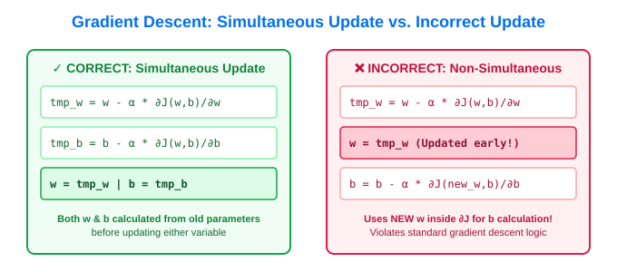
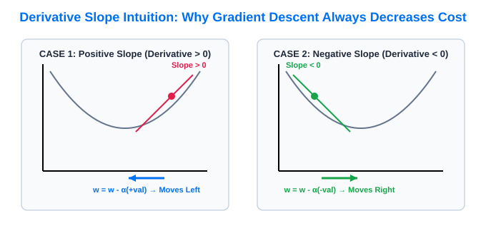
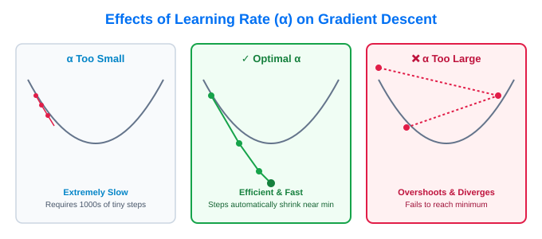

# 06. Gradient Descent Algorithm

> **Core Concept**: **Gradient Descent** is an iterative optimization algorithm used to automatically find parameter values ($w, b$) that minimize a cost function $J(w,b)$. It is the foundational training algorithm for Linear Regression, Neural Networks, and modern Artificial Intelligence.

---

## 📌 1. High-Level Intuition (Steepest Descent)

Imagine standing at a high point on a hilly landscape (the cost surface $J(w,b)$) with the goal of reaching the lowest valley as quickly as possible:

1. **Look 360° around your current position**.
2. **Determine the direction of steepest descent** (the direction that goes downhill fastest).
3. **Take a small step ($\alpha$)** in that direction.
4. **Repeat steps 1–3** until you reach the bottom of the valley (a minimum where slope = 0).


---

## 📐 2. Gradient Descent Update Equations

For Linear Regression with parameters $w$ (weight) and $b$ (bias):

$$\begin{aligned}
&\text{repeat until convergence: } \{ \\
&\quad w = w - \alpha \frac{\partial}{\partial w} J(w,b) \\
&\quad b = b - \alpha \frac{\partial}{\partial b} J(w,b) \\
&\}
\end{aligned}$$

### Parameter Breakdown:

| Notation | Term | Description |
| :--- | :--- | :--- |
| **$=$** | Assignment Operator | Assigns the newly calculated value to the parameter variable (in code: `w = w - ...`). |
| **$\alpha$** | Learning Rate | Small positive number (e.g. $0.01$) controlling how large a step is taken downhill. |
| **$\frac{\partial}{\partial w} J(w,b)$** | Partial Derivative w.r.t $w$ | Measures the slope/steepness of cost function $J$ along the $w$ direction. |
| **$\frac{\partial}{\partial b} J(w,b)$** | Partial Derivative w.r.t $b$ | Measures the slope/steepness of cost function $J$ along the $b$ direction. |

---

## ⚠️ 3. Simultaneous Updates (Critical Implementation Rule)

When implementing Gradient Descent in code, **both parameters $w$ and $b$ MUST be updated simultaneously** using their pre-update values.



### Correct vs. Incorrect Python Code:

```python
# ✓ CORRECT: Simultaneous Update
tmp_w = w - alpha * d_dw
tmp_b = b - alpha * d_db
w = tmp_w
b = tmp_b

# ❌ INCORRECT: Non-Simultaneous Update (Modifies w before computing b update!)
w = w - alpha * d_dw  # w is updated early!
b = b - alpha * d_db  # Incorrectly uses NEW w inside derivative for b
```

---

## 🧭 4. Derivative Slope & Movement Direction

The derivative term $\frac{\partial}{\partial w} J(w)$ provides the direction of movement toward the minimum:



| Initial Position | Tangent Slope ($\frac{\partial J}{\partial w}$) | Gradient Update Formula | Parameter Movement | Effect on Cost $J(w)$ |
| :--- | :--- | :--- | :--- | :--- |
| **Right of Minimum** | **Positive** ($>0$, slants UP right) | $w_{\text{new}} = w - \alpha (+\text{val})$ | $w$ decreases (moves LEFT) | Cost $J(w)$ decreases |
| **Left of Minimum** | **Negative** ($<0$, slants DOWN right) | $w_{\text{new}} = w - \alpha (-\text{val}) = w + \alpha (+\text{val})$ | $w$ increases (moves RIGHT) | Cost $J(w)$ decreases |
| **At Minimum** | **Zero** ($=0$, horizontal flat line) | $w_{\text{new}} = w - \alpha(0) = w$ | $w$ remains UNCHANGED | Cost $J(w)$ locked at minimum |

> 💡 **Automatic Step-Size Shrinking**: As parameters approach the minimum, the slope $\frac{\partial J}{\partial w}$ naturally flattens toward $0$. Thus, **step size $\alpha \frac{\partial J}{\partial w}$ automatically shrinks near the minimum**, even with a fixed learning rate $\alpha$!

---

## ⚡ 5. Learning Rate ($\alpha$) Choice & Dynamics



* **$\alpha$ Too Small (e.g., $0.0000001$)**:
  * Takes minuscule baby steps.
  * Guaranteed to converge, but **extremely slow** (requires millions of iterations).
* **$\alpha$ Too Large (e.g., $1.5$)**:
  * Overshoots the minimum and steps across the valley.
  * **Fails to converge** and may **diverge** (cost $J$ increases and bounces higher).
* **Optimal $\alpha$ (e.g., $0.01$)**:
  * Smooth, efficient convergence to the minimum.

---

## 🧮 6. Gradient Descent for Linear Regression (Derivatives & Convexity)

Plugging the partial derivatives of the **Mean Squared Error** cost function into Gradient Descent yields the exact update equations for Linear Regression:

### Partial Derivatives Derivation:

$$\frac{\partial}{\partial w} J(w,b) = \frac{1}{m} \sum_{i=1}^{m} \left( f_{w,b}(x^{(i)}) - y^{(i)} \right) x^{(i)}$$

$$\frac{\partial}{\partial b} J(w,b) = \frac{1}{m} \sum_{i=1}^{m} \left( f_{w,b}(x^{(i)}) - y^{(i)} \right)$$

*(Note: The factor of 2 from differentiating $(f-y)^2$ cancels out neatly with the $\frac{1}{2}$ in $\frac{1}{2m}$!)*

### Full Batch Gradient Descent Algorithm for Linear Regression:

$$\begin{aligned}
&\text{repeat until convergence: } \{ \\
&\quad w = w - \alpha \frac{1}{m} \sum_{i=1}^{m} \left( f_{w,b}(x^{(i)}) - y^{(i)} \right) x^{(i)} \\
&\quad b = b - \alpha \frac{1}{m} \sum_{i=1}^{m} \left( f_{w,b}(x^{(i)}) - y^{(i)} \right) \\
&\}
\end{aligned}$$

---

### 🛡️ Convex Function & Guaranteed Convergence

```
+-----------------------------------------------------------------------------------+
| CONVEXITY GUARANTEE IN LINEAR REGRESSION:                                         |
|                                                                                   |
| The Mean Squared Error cost function J(w,b) for linear regression is CONVEX.       |
| A convex function is strictly BOWL-SHAPED and has NO local minima other than     |
| a single GLOBAL MINIMUM.                                                          |
|                                                                                   |
| Property: Given an appropriate learning rate α, Gradient Descent is GUARANTEED   |
| to always converge to the single global minimum!                                  |
+-----------------------------------------------------------------------------------+
```

---

## 📦 7. Batch Gradient Descent Definition

* **Definition**: The term **"Batch" Gradient Descent** refers to the fact that at **every single step of gradient descent, the algorithm looks at ALL $m$ training examples** in the dataset to compute the summation ($\sum_{i=1}^{m}$).
* **Key Characteristic**:
  $$\text{Uses the entire batch of } m \text{ training examples at each step.}$$
* *Name Origin*: DeepLearning.AI's flagship newsletter *"The Batch"* was named after this fundamental machine learning concept!

---

## 🎯 Summary Checklist

- [x] **Update Equations**: $w = w - \alpha \frac{\partial J}{\partial w}$ and $b = b - \alpha \frac{\partial J}{\partial b}$.
- [x] **Simultaneous Update**: Must calculate both $w$ and $b$ updates simultaneously before reassigning either variable.
- [x] **Derivative Role**: Positive slope decreases parameter, negative slope increases parameter; slope = 0 locks parameter at minimum.
- [x] **Learning Rate ($\alpha$)**: Too small = slow; too large = overshoot/diverge; optimal = fast convergence.
- [x] **Linear Regression Derivatives**: Derivative w.r.t $w$ includes factor $x^{(i)}$; derivative w.r.t $b$ omits $x^{(i)}$.
- [x] **Convexity**: MSE cost function has 1 single global minimum, ensuring reliable convergence.
- [x] **Batch Gradient Descent**: Uses all $m$ training examples at every iteration.
