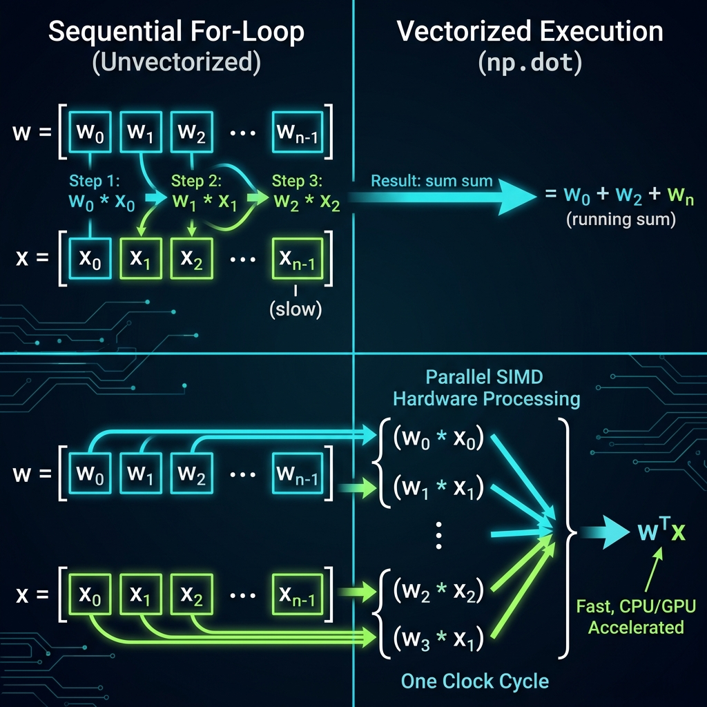

# 07. Multiple Linear Regression & Vectorization

> **Core Concept**: **Multiple Linear Regression** extends linear regression to handle multiple input features ($x_1, x_2, \dots, x_n$). Using **Vectorization** with NumPy transforms sequential loops into parallel hardware operations (`np.dot(w, x)`), drastically shortening code and accelerating execution speed by orders of magnitude.

---

## 📌 1. Multiple Features Notation & Model Definition

When predicting a target $y$ (e.g. house price), single-feature regression relies only on size ($x$). Multiple linear regression incorporates additional informative features like bedrooms, floors, and age.

### Standard Notation Reference:

| Notation | Description | Example (Housing Dataset) |
| :--- | :--- | :--- |
| **$n$** | Total number of input features | $n = 4$ (size, bedrooms, floors, age) |
| **$x_j$** | Feature $j$ ($j = 1 \dots n$) | $x_1 =$ size, $x_2 =$ bedrooms, $x_3 =$ floors, $x_4 =$ age |
| **$\vec{x}^{(i)}$** | Feature vector (row vector) of $i^{\text{th}}$ example | $\vec{x}^{(2)} = [1416, 3, 2, 40]$ |
| **$x_j^{(i)}$** | Value of feature $j$ in $i^{\text{th}}$ training example | $x_3^{(2)} = 2$ (floors in $2^{\text{nd}}$ house) |

---

## 📐 2. Hypothesis Representation & Parameter Interpretation

### Algebraic Form:

$$f_{\vec{w},b}(\vec{x}) = w_1 x_1 + w_2 x_2 + w_3 x_3 + \dots + w_n x_n + b$$

### Vector Dot Product Form:

Let parameter vector $\vec{w} = [w_1, w_2, \dots, w_n]$ and feature vector $\vec{x} = [x_1, x_2, \dots, x_n]$:

$$f_{\vec{w},b}(\vec{x}) = \vec{w} \cdot \vec{x} + b$$

Where the dot product is defined as $\vec{w} \cdot \vec{x} = \sum_{j=1}^{n} w_j x_j = w_1 x_1 + w_2 x_2 + \dots + w_n x_n$.

### Parameter Interpretation Case Study (Housing Prices in $\$1,000\text{s}$):

$$f_{\vec{w},b}(\vec{x}) = 0.1 x_1 + 4 x_2 + 10 x_3 - 2 x_4 + 80$$

- **Base Price ($b = 80$)**: Starting price of $\$80,000$ for a baseline house.
- **Size ($w_1 = 0.1$)**: $+\$100$ per additional square foot ($0.1 \times \$1,000$).
- **Bedrooms ($w_2 = 4$)**: $+\$4,000$ per additional bedroom.
- **Floors ($w_3 = 10$)**: $+\$10,000$ per additional floor.
- **Age ($w_4 = -2$)**: $-\$2,000$ for each additional year of age.

> 📌 **Terminology Note**:
> - **Univariate Linear Regression**: Single input feature ($x$).
> - **Multiple Linear Regression**: Multiple input features ($x_1, x_2, \dots, x_n$).
> - *Multivariate Regression*: Technical term reserved for models predicting *multiple output targets* ($y_1, y_2$).

---

## ⚡ 3. Vectorization & Hardware Parallelization

Vectorization allows your code to leverage specialized **SIMD (Single Instruction, Multiple Data)** parallel execution units on modern CPUs and GPUs.



### Comparing 3 Code Implementations ($n = 3$):

#### Option 1: Unvectorized Hardcoded Summation (Inefficient & Manual)
```python
# ❌ Hardcoded - Impractical for large n
f = w[0]*x[0] + w[1]*x[1] + w[2]*x[2] + b
```

#### Option 2: Sequential `for`-loop (Slow CPU Sequential Processing)
```python
# ❌ Sequential loop - Takes n clock cycles (t_0, t_1, t_2...)
f = 0.0
for j in range(n):
    f += w[j] * x[j]
f += b
```

#### Option 3: Vectorized NumPy Dot Product (Fast Parallel SIMD Processing)
```python
# ✓ Vectorized - 1 line of code, parallel hardware execution
import numpy as np

f = np.dot(w, x) + b
```

---

## 💻 4. Vectorized Parameter Updates in Gradient Descent

Vectorization applies not only to model predictions, but also to parameter update rules during gradient descent.

### Unvectorized `for`-loop Update ($n = 16$):
```python
# ❌ Sequential loop update
for j in range(n):
    w[j] = w[j] - alpha * d[j]
```

### Vectorized Array Subtraction (1 Parallel Operation):
```python
# ✓ Vectorized subtraction - Modifies all 16 weights simultaneously
w = w - alpha * d
```

### Performance Impact:
- **Small Datasets**: Noticeable speedup.
- **Large Datasets / High Dimensions ($n = 10,000+$)**: Reduces execution time from **hours to seconds**!

---

## 🎯 Summary Checklist

- [x] **Notation**: $n$ features, $x_j^{(i)}$ feature $j$ in example $i$, vector $\vec{x}^{(i)}$.
- [x] **Dot Product Form**: $f_{\vec{w},b}(\vec{x}) = \vec{w} \cdot \vec{x} + b$.
- [x] **Multiple vs Multivariate**: Multiple features ($x_1 \dots x_n$) vs Multiple outputs ($y_1, y_2$).
- [x] **NumPy Indexing**: 0-indexed arrays (`w[0]` corresponds to $w_1$).
- [x] **Vectorized Dot Product**: `np.dot(w, x) + b`.
- [x] **SIMD Parallelization**: CPU/GPU hardware executes vector operations in parallel in a single clock cycle.
