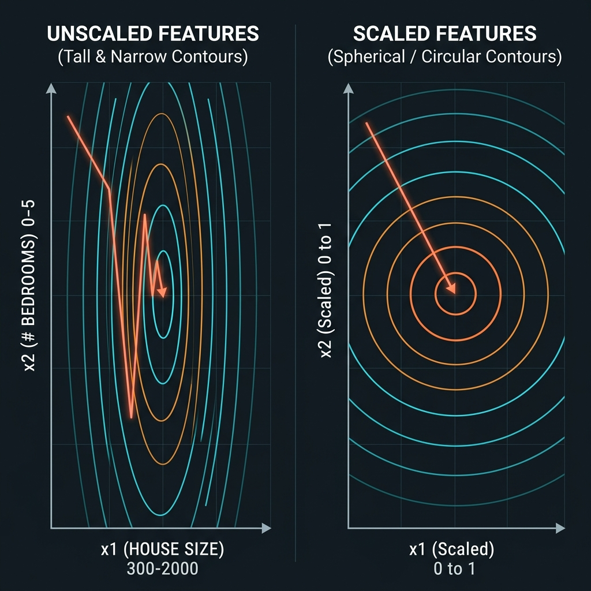
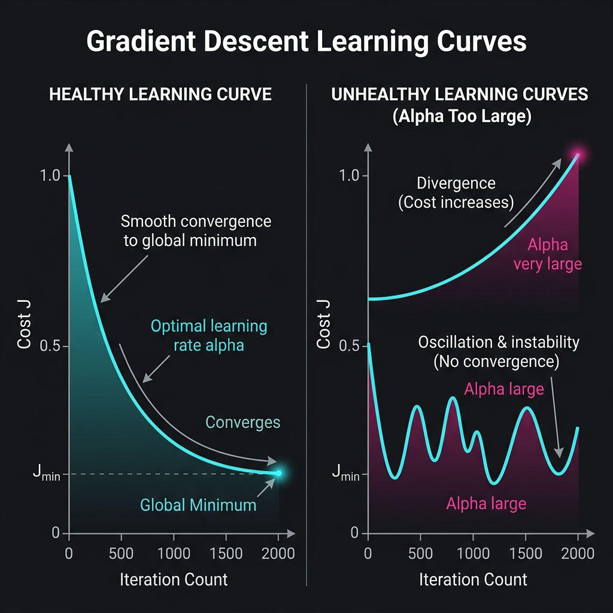

# 08. Feature Scaling, Learning Rate Tuning & Feature Engineering

> **Core Concept**: To make Multiple Linear Regression perform reliably and efficiently on real-world datasets, machine learning engineers use **Feature Scaling** (rescaling mismatched inputs), **Convergence Diagnostics** (tuning learning rate $\alpha$), and **Feature Engineering / Polynomial Regression** (transforming raw inputs to fit non-linear curves).

---

## 📌 1. Gradient Descent Updates & The Normal Equation

### A. Vectorized Gradient Descent Updates
For multiple features ($n \ge 2$), simultaneous updates for weights $w_j$ ($j = 1 \dots n$) and bias $b$ are computed as:

$$w_j = w_j - \alpha \frac{1}{m} \sum_{i=1}^{m} \left( f_{\vec{w},b}(\vec{x}^{(i)}) - y^{(i)} \right) x_j^{(i)}$$

$$b = b - \alpha \frac{1}{m} \sum_{i=1}^{m} \left( f_{\vec{w},b}(\vec{x}^{(i)}) - y^{(i)} \right)$$

---

### B. The Normal Equation Method (Analytical Solution)

An alternative to iterative gradient descent is the **Normal Equation**, which solves for optimal parameters $\vec{w}$ and $b$ analytically in **a single step without iterations**:

$$\vec{w} = (X^T X)^{-1} X^T \vec{y}$$

| Property | Gradient Descent | Normal Equation |
| :--- | :--- | :--- |
| **Iterative Steps** | Requires multiple iterations | Solves in **1 step** (no loops) |
| **Learning Rate $\alpha$** | Requires choosing $\alpha$ | **No $\alpha$ required** |
| **Scalability ($n$)** | Scales efficiently to large $n$ ($n > 10,000+$) | Very slow for large $n$ ($\mathcal{O}(n^3)$ matrix inversion) |
| **Generalizability** | Generalizes to Logistic Regression, Neural Nets, etc. | **Only works for Linear Regression** |

---

## ⚡ 2. Feature Scaling: Why Scaling Matters

When features have drastically different numerical ranges (e.g. house size $x_1 \in [300, 2000]$ sq ft vs bedrooms $x_2 \in [0, 5]$):
- A small change in $w_1$ causes massive jumps in cost $J$.
- The cost function contours form **tall, narrow ellipses**.
- Gradient descent **bounces back and forth erratically**, taking a long time to reach the minimum.



When features are rescaled to comparable ranges (e.g. $[0, 1]$), the contours become **spherical/circular**, enabling gradient descent to take a **direct, straight path** to the global minimum.

---

## 📐 3. Three Popular Feature Scaling Techniques

| Method | Formula | Range / Behavior |
| :--- | :--- | :--- |
| **Divide by Maximum** | $x_1 = \frac{x_1}{x_{\max}}$ | Rescales feature values to $[0, 1]$. |
| **Mean Normalization** | $x_1 = \frac{x_1 - \mu_1}{x_{\max} - x_{\min}}$ | Centers feature values around $0$, typically in $[-1, +1]$. |
| **Z-Score Standardization** | $x_1 = \frac{x_1 - \mu_1}{\sigma_1}$ | Uses mean $\mu_1$ and standard deviation $\sigma_1$, resulting in a Gaussian distribution centered at $0$ (typically $[-3, +3]$). |

### 💡 Rules of Thumb for Feature Scaling:

- **Target Range**: Ideally around $[-1, +1]$.
- **Acceptable Ranges (No Scaling Required)**: $[-3, +3]$, $[-0.3, +0.3]$, $[0, 3]$.
- **Must-Scale Ranges**: $[-100, +100]$ (too large), $[-0.001, +0.001]$ (too small), $[98.6, 105]$ (large offset).
- **Golden Rule**: When in doubt, **always perform feature scaling**! There is no downside.

---

## 📊 4. Convergence Diagnostics & Learning Rate ($\alpha$) Tuning



### A. The Learning Curve (Cost $J$ vs. Iterations)
Plotting the cost $J(\vec{w},b)$ against the **number of iterations**:
- **Healthy Curve**: Cost $J$ should decrease on **every single iteration** and flatten out as it reaches the global minimum.
- **Unhealthy Curve (Oscillating/Rising)**: Indicates that $\alpha$ is too large or there is a bug in the code.

### B. Automatic Convergence Test
Declare convergence if the cost decreases by less than a small threshold $\epsilon = 10^{-3}$ ($0.001$) in a single iteration:

$$\Delta J = J^{(\text{iter}-1)} - J^{(\text{iter})} < \epsilon \implies \text{Declared Converged}$$

### C. Debugging Gradient Descent Code
- **Diagnostic Tip**: Set $\alpha$ to a tiny value (e.g. $10^{-6}$). If cost $J$ STILL increases, there is a bug in your gradient formula (e.g. accidentally using `+` instead of `-` in parameter updates).

### D. Systematic $\alpha$ Search Strategy
Test a range of $\alpha$ values scaled by approximately $3\times$:

$$0.001 \longrightarrow 0.003 \longrightarrow 0.01 \longrightarrow 0.03 \longrightarrow 0.1 \longrightarrow 0.3 \longrightarrow 1.0$$

Select the **largest learning rate** that decreases the cost rapidly and consistently without overshooting.

---

## 🛠️ 5. Feature Engineering & Polynomial Regression

### A. Feature Engineering
Using domain knowledge to create new features by combining or transforming original inputs.
- **Example**: Given frontage width $x_1$ and depth $x_2$, define a new land area feature:
  $$x_3 = x_1 \cdot x_2 \quad (\text{Lot Area})$$
  $$f_{\vec{w},b}(\vec{x}) = w_1 x_1 + w_2 x_2 + w_3 x_3 + b$$

### B. Polynomial Regression (Fitting Curves)
By creating non-linear feature transformations ($x^2, x^3, \sqrt{x}$), linear regression algorithms can fit complex curves to data:

```
Quadratic Model:   f(x) = w_1 x + w_2 x^2 + b
Cubic Model:       f(x) = w_1 x + w_2 x^2 + w_3 x^3 + b
Square Root Model: f(x) = w_1 x + w_2 sqrt(x) + b   (Prevents drop-off for large sizes)
```

> ⚠️ **CRITICAL: Feature Scaling is Mandatory for Polynomial Features!**
> If $x \in [1, 1000]$, then:
> - $x^1 \in [1, 1000]$
> - $x^2 \in [1, 1,000,000]$
> - $x^3 \in [1, 1,000,000,000]$
>
> Without feature scaling, polynomial features span wildly different orders of magnitude, causing severe gradient descent instability!

---

## 🎯 Summary Checklist

- [x] **Vectorized Gradient Update**: $w_j = w_j - \alpha \frac{1}{m} \sum (f(\vec{x}^{(i)}) - y^{(i)}) x_j^{(i)}$.
- [x] **Normal Equation**: $(X^T X)^{-1} X^T \vec{y}$ solves parameters analytically in 1 step (slow for large $n$).
- [x] **Feature Scaling**: Transforms elliptical cost contours into circular contours, accelerating gradient descent.
- [x] **Scaling Methods**: Division by max, Mean Normalization, Z-score Standardization ($Z = \frac{x-\mu}{\sigma}$).
- [x] **Learning Curve**: $J$ vs. Iterations must decrease monotonically on every iteration.
- [x] **Systematic $\alpha$ Search**: Try $0.001, 0.003, 0.01, 0.03, 0.1, 0.3, 1.0$.
- [x] **Feature Engineering**: Creating new features like $x_3 = x_1 \cdot x_2$.
- [x] **Polynomial Regression**: Fitting curves ($x^2, x^3, \sqrt{x}$) with mandatory feature scaling.
