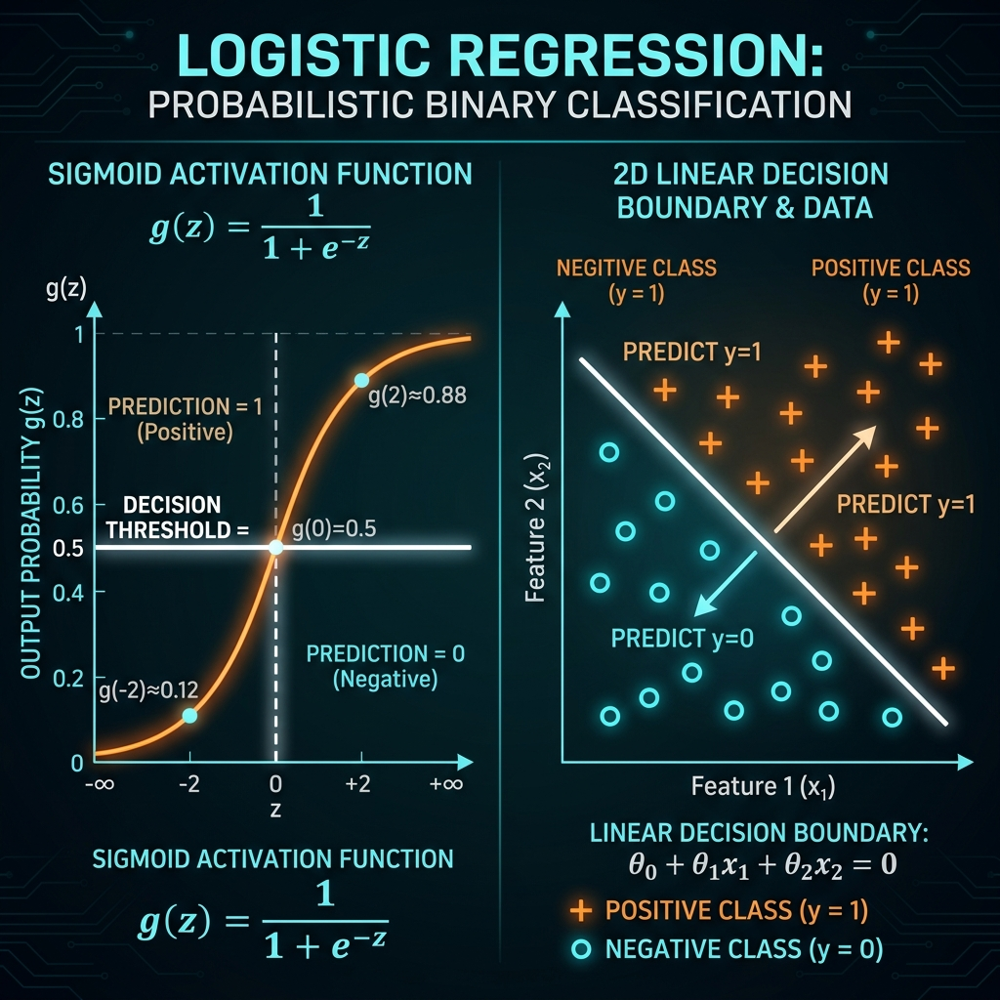

# 09. Logistic Regression Model, Decision Boundaries & Loss Function

> **Core Concept**: **Logistic Regression** is the primary algorithm for binary classification problems ($y \in \{0, 1\}$). It maps linear combinations of features through the **Sigmoid (logistic) function** to output probabilities between $0$ and $1$. It uses **Binary Cross-Entropy Loss** to guarantee a convex cost function for gradient descent.

---

## 📌 1. Classification Problems vs. Linear Regression Failure

In classification, the output label $y$ is discrete:
- **Binary Classification**: $y \in \{0, 1\}$ (e.g. Spam vs. Non-Spam, Fraudulent vs. Legitimate, Malignant vs. Benign).
  - $y = 1 \implies$ Positive Class
  - $y = 0 \implies$ Negative Class

### Why Linear Regression Fails for Classification:
1. **Unbounded Outputs**: Linear regression produces predictions $f(\vec{x}) \in (-\infty, +\infty)$, which cannot represent probabilities.
2. **Outlier Sensitivity**: Adding a distant positive example shifts the straight line fit, causing valid positive training points to fall below the $0.5$ threshold and misclassifying them.

---

## 📐 2. The Logistic Regression Hypothesis & Sigmoid Function

To constrain model outputs strictly between $0$ and $1$, we pass $z = \vec{w} \cdot \vec{x} + b$ through the **Sigmoid (Logistic) Activation Function**:

$$g(z) = \frac{1}{1 + e^{-z}}$$

$$f_{\vec{w},b}(\vec{x}) = g(\vec{w} \cdot \vec{x} + b) = \frac{1}{1 + e^{-(\vec{w} \cdot \vec{x} + b)}}$$

### Key Sigmoid Properties:
- When $z = 0 \implies g(0) = \frac{1}{1 + e^0} = 0.5$.
- When $z \to +\infty \implies g(z) \to 1$.
- When $z \to -\infty \implies g(z) \to 0$.

### Probabilistic Interpretation:
$f_{\vec{w},b}(\vec{x})$ represents the **estimated probability that $y = 1$** given input vector $\vec{x}$:

$$f_{\vec{w},b}(\vec{x}) = P(y = 1 \mid \vec{x}; \vec{w}, b)$$

$$P(y = 0 \mid \vec{x}; \vec{w}, b) = 1 - f_{\vec{w},b}(\vec{x})$$

---

## 🧭 3. Decision Boundaries

To assign a discrete prediction $\hat{y} \in \{0, 1\}$, we apply a **$0.5$ threshold**:

$$\hat{y} = \begin{cases} 1 & \text{if } f_{\vec{w},b}(\vec{x}) \ge 0.5 \iff z \ge 0 \iff \vec{w} \cdot \vec{x} + b \ge 0 \\ 0 & \text{if } f_{\vec{w},b}(\vec{x}) < 0.5 \iff z < 0 \iff \vec{w} \cdot \vec{x} + b < 0 \end{cases}$$

### Linear Decision Boundary:
The equation $\vec{w} \cdot \vec{x} + b = 0$ defines the line (or hyperplane) separating $\hat{y} = 1$ from $\hat{y} = 0$.
- *Example*: $x_1 + x_2 - 3 = 0 \implies x_1 + x_2 = 3$ is a straight line boundary.

### Non-Linear Polynomial Decision Boundaries:
By incorporating polynomial features ($x_1^2, x_2^2$), logistic regression can form complex, non-linear boundaries:
- *Example (Circle Boundary)*: $x_1^2 + x_2^2 - 1 = 0 \implies x_1^2 + x_2^2 = 1$ (Predict $\hat{y} = 1$ outside circle, $\hat{y} = 0$ inside).

---

## ⚠️ 4. Why Squared Error Cost Fails (Non-Convexity)

If we plug the sigmoid hypothesis $f(\vec{x}) = \frac{1}{1 + e^{-z}}$ into the Mean Squared Error (MSE) cost function, the resulting cost surface is **non-convex**:
- It contains numerous **local minima** and flat plateau regions.
- Gradient descent gets trapped in suboptimal local minima and fails to find the global solution.

---

## 🧮 5. Logistic Loss (Binary Cross-Entropy) & Convex Cost Function

To guarantee a strictly **convex cost function**, we use **Binary Cross-Entropy Loss** (derived via Maximum Likelihood Estimation):

### Single Example Loss Definition:

$$L(f_{\vec{w},b}(\vec{x}), y) = \begin{cases} -\log(f_{\vec{w},b}(\vec{x})) & \text{if } y = 1 \\ -\log(1 - f_{\vec{w},b}(\vec{x})) & \text{if } y = 0 \end{cases}$$

- **Case $y = 1$**: As $f(\vec{x}) \to 1$, Loss $\to 0$. As $f(\vec{x}) \to 0$, Loss $\to \infty$ (heavily penalizing false negatives).
- **Case $y = 0$**: As $f(\vec{x}) \to 0$, Loss $\to 0$. As $f(\vec{x}) \to 1$, Loss $\to \infty$ (heavily penalizing false positives).

### Simplified Single-Line Loss Equation:

$$L(f_{\vec{w},b}(\vec{x}), y) = -y \log(f_{\vec{w},b}(\vec{x})) - (1 - y) \log(1 - f_{\vec{w},b}(\vec{x}))$$

### Overall Cost Function $J(\vec{w},b)$:

$$J(\vec{w},b) = -\frac{1}{m} \sum_{i=1}^{m} \left[ y^{(i)} \log(f_{\vec{w},b}(\vec{x}^{(i)})) + (1 - y^{(i)}) \log(1 - f_{\vec{w},b}(\vec{x}^{(i)})) \right]$$

---

## ⚙️ 6. Gradient Descent Updates for Logistic Regression

To minimize the convex cost function $J(\vec{w},b)$, repeat until convergence (**Simultaneous Updates**):

$$w_j = w_j - \alpha \frac{1}{m} \sum_{i=1}^{m} \left( f_{\vec{w},b}(\vec{x}^{(i)}) - y^{(i)} \right) x_j^{(i)} \quad (j = 1 \dots n)$$

$$b = b - \alpha \frac{1}{m} \sum_{i=1}^{m} \left( f_{\vec{w},b}(\vec{x}^{(i)}) - y^{(i)} \right)$$

> ⚡ **Mathematical Parallel**: The update formula looks identical to Linear Regression! However, it is a completely distinct algorithm because $f_{\vec{w},b}(\vec{x}) = g(\vec{w} \cdot \vec{x} + b) = \frac{1}{1 + e^{-z}}$ (sigmoid activation).

---

## 🎯 Summary Checklist

- [x] **Binary Classification**: $y \in \{0, 1\}$.
- [x] **Sigmoid Function**: $g(z) = \frac{1}{1 + e^{-z}}$, maps $z \in (-\infty, +\infty) \to (0, 1)$.
- [x] **Decision Threshold**: Predict $\hat{y} = 1$ when $f(\vec{x}) \ge 0.5 \iff z \ge 0$.
- [x] **Decision Boundary**: Hyperplane $\vec{w} \cdot \vec{x} + b = 0$ separating classes.
- [x] **Convex Loss**: Binary Cross-Entropy $-y \log f - (1-y) \log (1-f)$.
- [x] **Gradient Update**: Structural unity with linear regression using sigmoid predictions.
